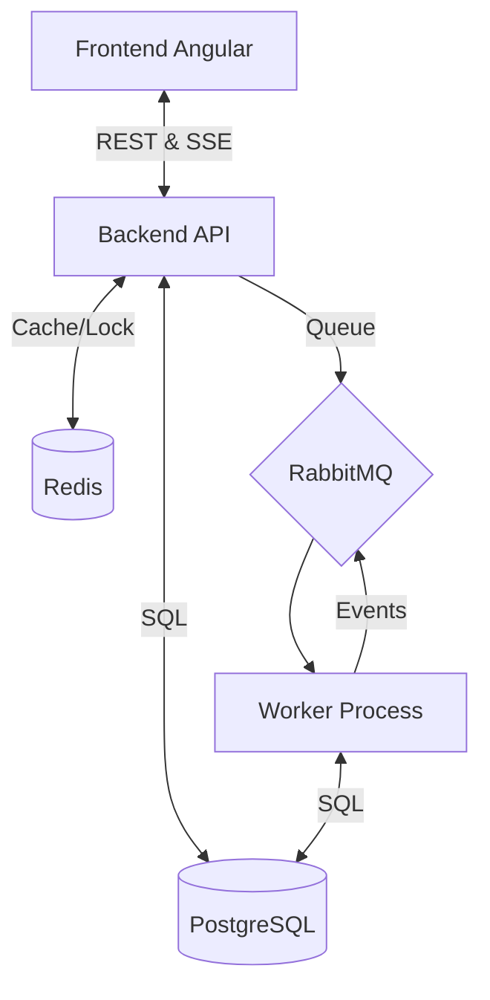

# Big Chat Brasil (BCB) - Plataforma de Mensagens

Este repositório contém a solução completa para o desafio **Big Chat Brasil**, desenvolvida com uma arquitetura moderna e escalável utilizando **NestJS**, **Angular**, **PostgreSQL**, **Redis** e **RabbitMQ**.

---

## 🏗️ Arquitetura do Sistema

O sistema é baseado em uma arquitetura orientada a eventos (Event-Driven), permitindo o processamento assíncrono de mensagens e atualizações em tempo real.



---

## 📚 Documentação Técnica Completa

Para detalhes aprofundados sobre a arquitetura, fluxos e padrões, acesse a pasta [/docs](./docs):

### 1. Arquitetura e Fluxo
*   [Componentes (C4 Nível 3)](./docs/architecture/c4-components.md)
*   [Fluxo Integrado Ponta a Ponta](./docs/architecture/c4-integrated-flow.md)
*   [Ciclo de Vida da Mensagem (Sequência)](./docs/architecture/sequence-diagram-messages.md)

### 2. Design Docs
*   [Backend Design Doc](./docs/design-docs/backend-design-doc.md)
*   [Frontend Design Doc](./docs/design-docs/frontend-design-doc.md)

### 3. Guias e Referência
*   [Documentação da API (Endpoints & SSE)](./docs/reference/api-documentation.md)
*   [Guia de Telas e Funcionalidades](./docs/reference/frontend-screens-guide.md)
*   [Especificação Técnica Detalhada](./docs/technical-spec.md)

### 4. Extra
*   [Esquema do Banco de Dados](./docs/extra/database-schema.md)
*   [Guia de Operação e Troubleshooting](./docs/extra/troubleshooting-and-ops.md)
*   [Padrões de Código e Contribuição](./docs/extra/contributing-and-standards.md)

---

## 🚀 Como Rodar

### Pré-requisitos
*   Docker e Docker Compose instalados.

### Execução via Docker (Recomendado)
Para subir todo o ecossistema (API, Worker, PostgreSQL, RabbitMQ, Redis e Frontend):

```bash
docker-compose -f docker-compose.dev.yml up --build
```

### Portas Úteis:
*   **Frontend:** [http://localhost:4200](http://localhost:4200)
*   **Backend API:** [http://localhost:3000/api](http://localhost:3000/api)
*   **Swagger Docs:** [http://localhost:3000/api/docs](http://localhost:3000/api/docs)
*   **RabbitMQ Management:** [http://localhost:15672](http://localhost:15672) (user: `bcb_mq_user`, pass: `bcb_mq_password`)

---

## 🧪 Como Testar a Autenticação

A autenticação é baseada no documento do cliente (CPF ou CNPJ). Ao iniciar a aplicação, o banco de dados é populado automaticamente com os seguintes usuários de teste:

1.  **Cliente Pré-pago (Empresa Alpha)**
    - **Documento (CPF):** `11111111111`
    - **Saldo Inicial:** R$ 10,00
2.  **Cliente Pós-pago (Empresa Beta)**
    - **Documento (CNPJ):** `22222222222222`
    - **Limite:** R$ 50,00

---

## 🛠 Tecnologias Principais

*   **Backend**: NestJS v11, TypeORM, RabbitMQ, Redis, SSE.
*   **Frontend**: Angular v22, Signals, RxJS, Angular Material.
*   **Infra**: Docker, PostgreSQL.

