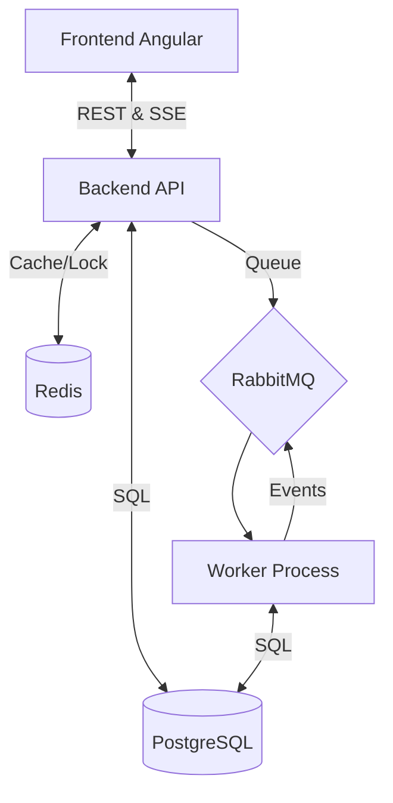

# Big Chat Brasil (BCB) - Plataforma de Mensagens

## 1. Visão Geral do Projeto
O **Big Chat Brasil** é uma plataforma de chat e mensageria em tempo real de alto desempenho. A solução foi projetada para simular o ciclo completo de entrega de mensagens, oferecendo gestão robusta de saldo/créditos por tipo de cliente (pré-pago e pós-pago) e priorização inteligente de envios (filas diferenciadas para mensagens urgentes e normais).

## 2. Arquitetura & Tecnologias Utilizadas

O sistema utiliza uma arquitetura orientada a eventos (Event-Driven) e micro-processamento para garantir escalabilidade e resiliência.

*   **Frontend**: Angular 17+ (Standalone Components, Signals, RxJS, Angular Material, SSE Client).
*   **Backend**: NestJS (TypeScript, TypeORM, SSE/Server-Sent Events para atualizações em tempo real).
*   **Worker**: NestJS Microservice (Consumidor de filas RabbitMQ dedicado ao processamento de mensagens e simulação de ciclo de vida).
*   **Banco de Dados & Cache**: PostgreSQL (Persistência relacional) e Redis (Cache de alta performance e controle de concorrência).
*   **Mensageria / Event Broker**: RabbitMQ (Gerenciamento de filas de processamento e distribuição de eventos).

### Diagrama de Arquitetura


## 3. Pré-requisitos
Antes de começar, certifique-se de ter instalado em sua máquina:
*   **Docker Engine 20.10+** e **Docker Compose v2+**.
*   **Git**.

## 4. Guia Rápido de Execução (Passo a Passo)

Siga os comandos abaixo para clonar e subir a aplicação completa em uma máquina limpa:

```bash
# 1. Clonar o repositório
git clone https://github.com/seu-usuario/big-chat-brasil.git
cd big-chat-brasil

# 2. Criar arquivo de variáveis de ambiente
# O comando abaixo copia o exemplo configurado para o ambiente Docker
cp .env.example .env

# 3. Subir todos os containers
# Este comando irá baixar as imagens, buildar os serviços e iniciar o ecossistema
docker compose up --build
```

## 5. Mapeamento de Serviços e Portas

Após a execução, os serviços estarão disponíveis nos seguintes endereços:

| Serviço | URL / Acesso | Credenciais (Padrão) |
| :--- | :--- | :--- |
| **Frontend Web** | [http://localhost:4200](http://localhost:4200) | - |
| **API Backend** | [http://localhost:3000](http://localhost:3000) | - |
| **Swagger UI (Docs API)** | [http://localhost:3000/api/docs](http://localhost:3000/api/docs) | - |
| **Painel RabbitMQ** | [http://localhost:15672](http://localhost:15672) | `guest` / `guest` (ou as definidas no .env) |
| **PostgreSQL** | `localhost:5432` | `bcb_user` / `bcb_password` |
| **Redis** | `localhost:6379` | - |

## 6. Funcionalidades Chave & Ciclo de Vida da Mensagem

### Gestão de Prioridade
O sistema diferencia mensagens por urgência:
*   **Urgente**: Processamento imediato via fila de alta prioridade.
*   **Normal**: Processamento assíncrono em fila convencional.

### Ciclo de Vida Simulado
As mensagens passam por estados automáticos simulados pelo **Worker**, refletindo um cenário real de operadora:
1.  `queued` (Na fila)
2.  `processing` (Sendo processada pelo Worker)
3.  `sent` (Enviada para o gateway)
4.  `delivered` (Entregue no destino)
5.  `read` (Lida pelo destinatário)
6.  *Ou `failed` em caso de erro/falta de saldo.*

### Atualizações em Tempo Real
Graças ao uso de **Server-Sent Events (SSE)**, o Frontend recebe notificações instantâneas do Worker (via Backend) sempre que o status de uma mensagem muda, sem necessidade de refresh ou polling.

## 7. Documentação Detalhada
Para informações técnicas mais profundas, consulte nossa base de documentos na pasta `/docs`:

*   [Arquitetura e Fluxo de Dados](./docs/architecture/architecture.md)
*   [Especificação Técnica](./docs/technical-spec.md)
*   [Documentação da API](./docs/reference/api-documentation.md)
*   [Design do Frontend](./docs/design-docs/frontend-design-doc.md)

---
Desenvolvido como parte do desafio técnico Big Chat Brasil.

