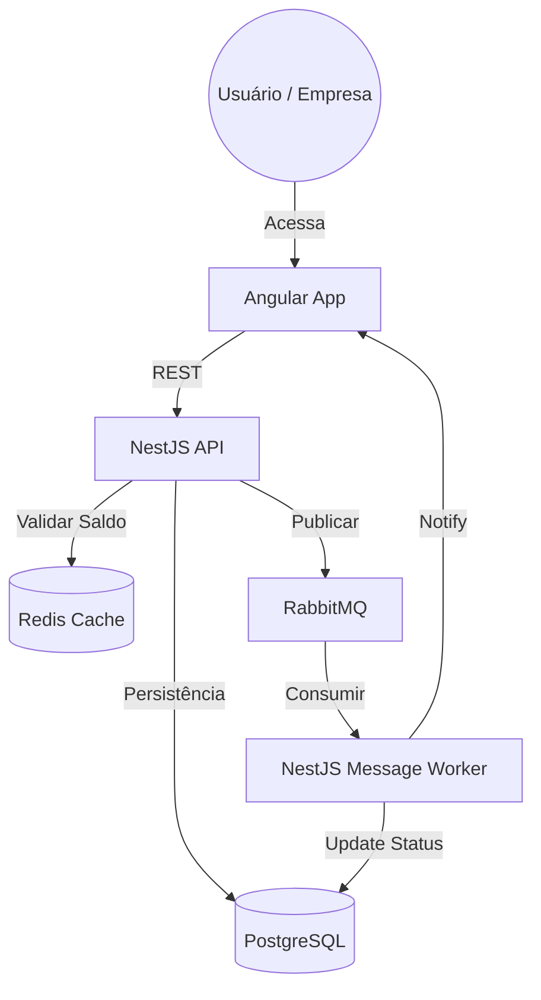
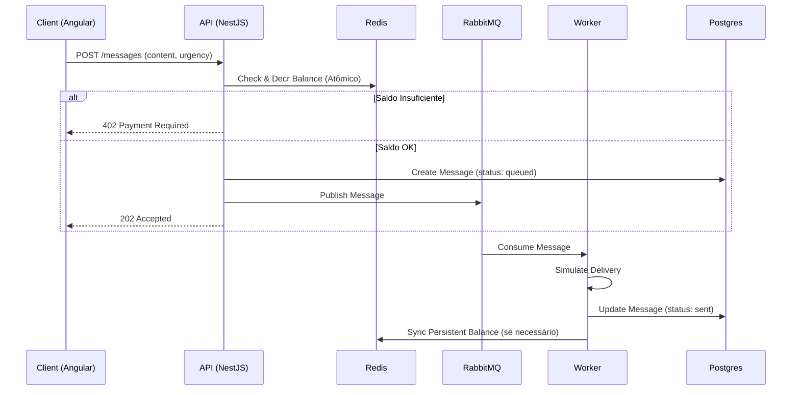
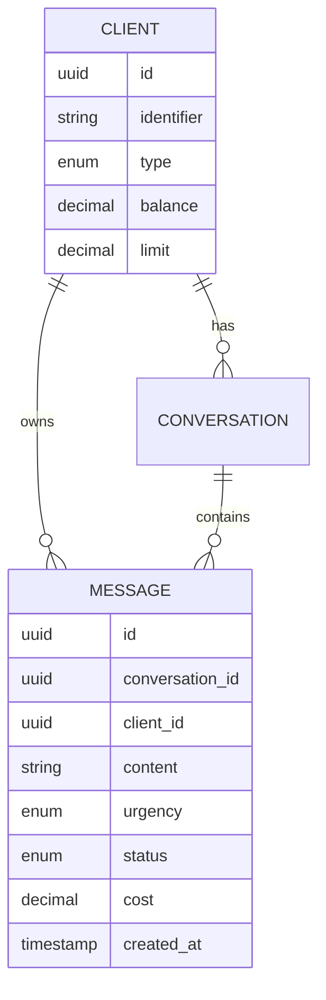

# Design Doc - Big Chat Brasil (BCB)

## 1. Visão Geral
A plataforma BCB gerencia mensagens priorizadas com validação financeira em tempo real. O uso de RabbitMQ garante o desacoplamento entre a submissão da mensagem e seu processamento (envio real), enquanto o Redis otimiza a verificação de saldo/limite.

## 2. ADRs (Architecture Decision Records)

### ADR-001: NestJS + Clean Architecture
*   **Contexto:** Necessidade de um backend robusto, tipado e escalável.
*   **Decisão:** Usar NestJS com separação em Domain, Application e Infrastructure.
*   **Consequência:** Facilita testes unitários e troca de provedores de infra (ex: TypeORM).

### ADR-002: RabbitMQ com Consumo Ponderado (Anti-Starvation)
*   **Contexto:** Mensagens urgentes devem ser priorizadas, mas mensagens normais não podem "morrer de fome" (starvation).
*   **Decisão:** Duas filas distintas. O Worker implementará um consumo proporcional (ex: a cada 3 urgentes, processa 1 normal).
*   **Consequência:** Garante o SLA das urgentes sem bloquear o fluxo normal indefinidamente.

### ADR-003: Validação de Saldo com Redis (Atomicidade)
*   **Contexto:** Evitar "double spending" em ambientes com múltiplas instâncias.
*   **Decisão:** O saldo será cacheado no Redis. Operações de débito usarão comandos atômicos (`DECRBY`) ou Lua Scripts para validar e debitar antes de enfileirar.
*   **Consequência:** Alta performance e consistência eventual garantida pela sincronização posterior com Postgres.

## 3. Diagramas Mermaid

### C4 Container

### Fluxo de Envio de Mensagem (Sequência)

### Diagrama ER

