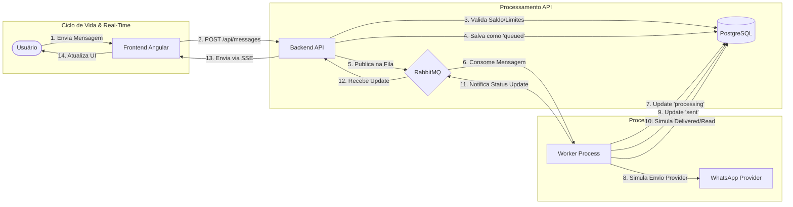

# Diagrama C4 de Fluxo Integrado

Este diagrama descreve o fluxo de dados ponta a ponta, desde a interação do usuário no frontend até o processamento pelo worker e o retorno em tempo real via SSE.

### Detalhes do Fluxo

1.  **Ingressão**: O usuário envia uma mensagem ou lote de mensagens via interface Angular.
2.  **Validação e Persistência**: A API recebe a requisição, verifica o saldo do cliente (utilizando locks pessimistas para evitar double-spending) e persiste a mensagem com o status inicial `queued`.
3.  **Filas**: A mensagem é encaminhada para o RabbitMQ, respeitando a prioridade (`normal` vs `urgente`).
4.  **Consumo**: O Worker retira a mensagem da fila, altera seu estado para `processing` e simula a comunicação com o provedor externo.
5.  **Simulação de Ciclo de Vida**: Um serviço de simulação no Worker continua atualizando os status da mensagem (`sent` -> `delivered` -> `read`) para emular o comportamento real do WhatsApp.
6.  **Real-Time**: Cada mudança de status gera um evento que volta para o RabbitMQ e é capturado pela API, que por sua vez o encaminha para o Frontend via **Server-Sent Events (SSE)**.
