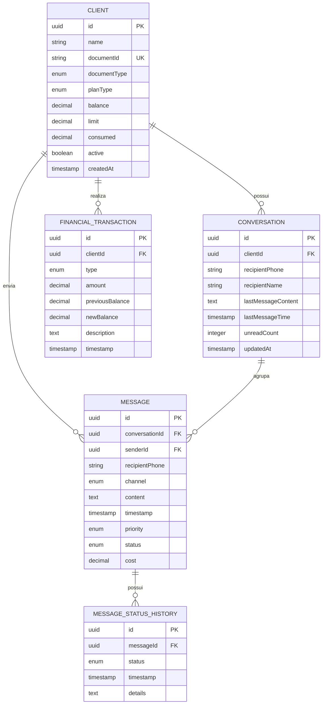

# Modelo de Domínio

Este documento descreve o modelo de domínio e a estrutura de persistência da plataforma Big Chat Brasil (BCB).

## Diagrama ER (Mermaid)

## Descrição Técnica das Tabelas

### 1. Clients (`clients`)
Armazena os dados cadastrais e de faturamento dos clientes.
- **FKs:** Nenhuma.
- **Índices:** `documentId` (Unique).

### 2. Conversations (`conversations`)
Agrupa as mensagens trocadas entre um cliente e um destinatário final.
- **FKs:** 
    - `clientId` -> `clients(id)` (ON DELETE CASCADE).

### 3. Messages (`messages`)
Registro individual de cada mensagem enviada.
- **FKs:**
    - `conversationId` -> `conversations(id)` (ON DELETE CASCADE).
    - `senderId` -> `clients(id)` (ON DELETE RESTRICT).

### 4. Message Status History (`message_status_history`)
Auditoria de todas as mudanças de estado de uma mensagem (queued, sent, delivered, etc).
- **FKs:**
    - `messageId` -> `messages(id)` (ON DELETE CASCADE).

### 5. Financial Transactions (`financial_transactions`)
Histórico de movimentações financeiras para controle de saldo e consumo.
- **FKs:**
    - `clientId` -> `clients(id)` (ON DELETE RESTRICT).
