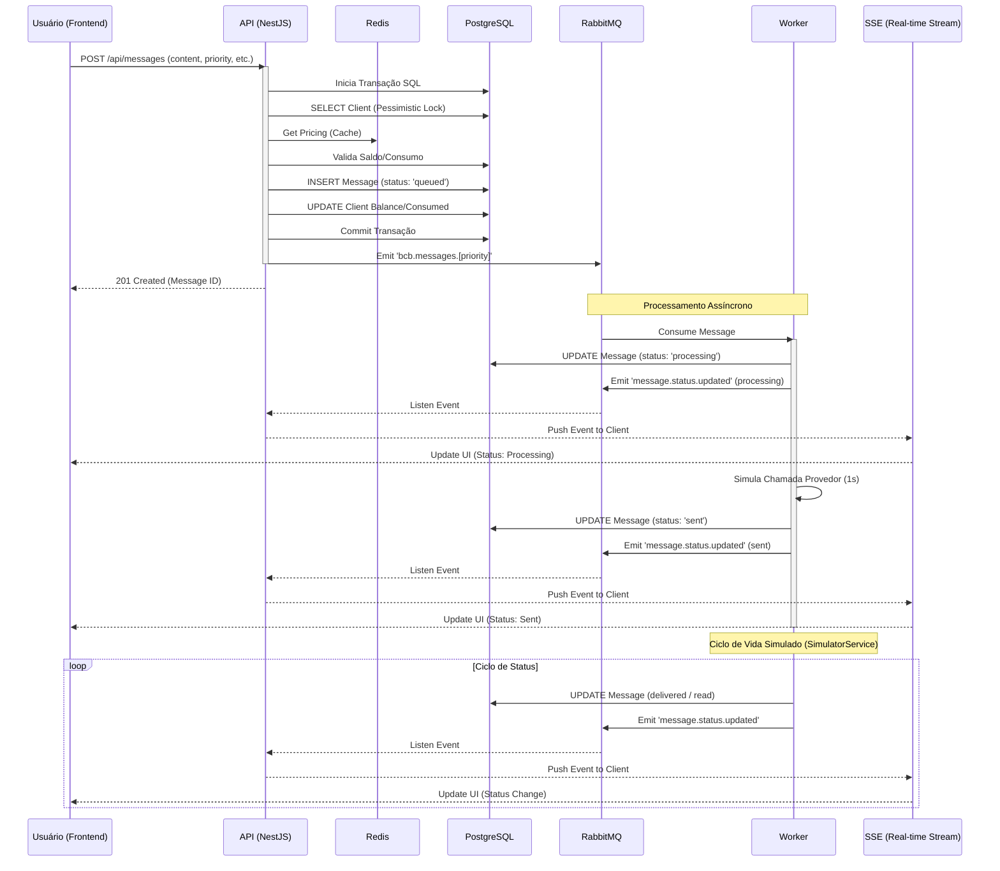

# Diagrama de Sequência de Mensagens

Este diagrama detalha o ciclo de vida completo de uma mensagem, incluindo o tratamento de prioridades e a comunicação assíncrona.

### Destaques do Processo

*   **Priorização**: Mensagens marcadas como `urgente` são enviadas para a routing key `bcb.messages.urgent`, enquanto mensagens padrão vão para `bcb.messages.normal`. O Worker está configurado para observar ambos os padrões, permitindo que a infraestrutura do RabbitMQ gerencie a distribuição.
*   **Anti-Starvation**: O Worker monitora o tempo de espera das mensagens na fila `normal`. Se uma mensagem exceder 30 segundos, o sistema registra um aviso (log) para intervenção ou ajuste de escala.
*   **Concorrência**: O uso de `pessimistic_write` no banco de dados durante o débito de saldo garante que múltiplos envios simultâneos do mesmo cliente não resultem em saldo negativo.
*   **Persistência**: Todas as mudanças de estado são registradas na tabela `message_status_history` para fins de auditoria e rastreabilidade.
