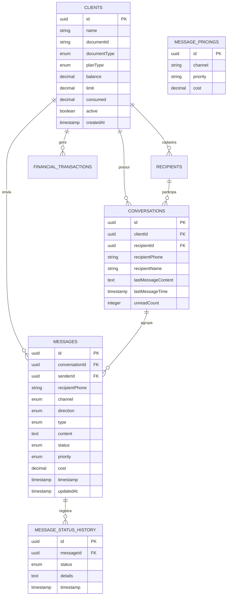

# Esquema do Banco de Dados (ERD & Dicionário)

O Big Chat Brasil utiliza o PostgreSQL como banco de dados relacional principal. Abaixo está a descrição das tabelas e o diagrama de relacionamento.

## 1. Diagrama ERD

## 2. Dicionário de Dados

### Tabela `clients`
Armazena os dados dos clientes da plataforma (empresas ou pessoas físicas).
*   `id`: Identificador único UUID.
*   `planType`: Define se o cliente é **pré-pago** (usa `balance`) ou **pós-pago** (usa `limit`/`consumed`).
*   `documentId`: CPF ou CNPJ único.

### Tabela `messages`
Registro principal de cada disparo de mensagem efetuado.
*   `status`: Reflete o estado atual (`queued`, `processing`, `sent`, `delivered`, `read`, `failed`).
*   `cost`: O valor debitado do cliente no momento do envio.

### Tabela `message_status_history`
Auditoria completa de cada transição de status de uma mensagem. Permite rastrear exatamente quando uma mensagem foi entregue ou lida.

### Tabela `message_pricings`
Tabela de configuração de custos.
*   `channel`: Tipo de canal (ex: WHATSAPP, SMS).
*   `priority`: Nível de prioridade (ex: normal, urgente).
*   `cost`: Valor em reais por mensagem.

### Tabela `conversations`
Agrupamento lógico de mensagens para exibição no formato de chat (threads).
